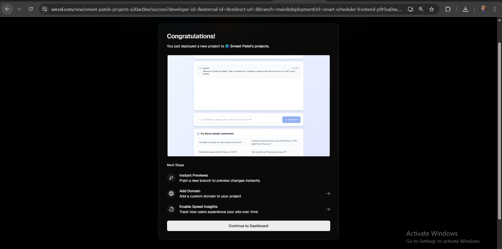
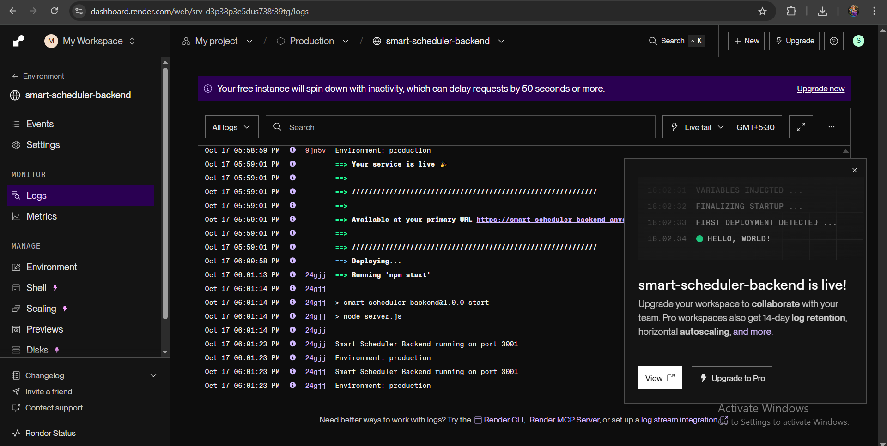

# Smart Scheduler AI

**Smart Scheduler AI** is a full-stack agentic web application that lets users create Google Calendar events using plain natural language.
Type commands like *“Schedule a meeting with John tomorrow at 10 AM”* or *“Create a Team Discussion next Monday at 3 PM”* and the app extracts date/time/title via an AI model and creates the event in your Google Calendar.

---

[](https://smart-scheduler-frontend.vercel.app) [](https://smart-scheduler-backend.onrender.com) [](https://drive.google.com/file/d/13EnhYpwlayN0PZObUm-W7KbJ0GFztp7Y/view?usp=sharing)

* **Frontend (live):** `https://smart-scheduler-frontend.vercel.app`
* **Backend (live):** `https://smart-scheduler-backend.onrender.com`
* **Demo Video:** [https://drive.google.com/file/d/13EnhYpwlayN0PZObUm-W7KbJ0GFztp7Y/view?usp=sharing](https://drive.google.com/file/d/13EnhYpwlayN0PZObUm-W7KbJ0GFztp7Y/view?usp=sharing)
* **Original repos:**

  * [https://github.com/smeetpatel2530/smart-scheduler-backend](https://github.com/smeetpatel2530/smart-scheduler-backend)
  * [https://github.com/smeetpatel2530/smart-scheduler-frontend](https://github.com/smeetpatel2530/smart-scheduler-frontend)

---

## Table of Contents

1. [Project Summary](#project-summary)
2. [Features](#features)
3. [Tech Stack](#tech-stack)
4. [Folder Structure](#folder-structure)
5. [Screenshots](#screenshots)
6. [Quickstart — Run Locally](#quickstart--run-locally)
7. [Environment Variables](#environment-variables)
8. [Deploying (free)](#deploying-free)
9. [API Endpoints (Backend)](#api-endpoints-backend)
10. [Test Mode](#test-mode)
11. [License & Contact](#license--contact)

---

## Project Summary

Smart Scheduler AI accepts natural-language scheduling requests, uses an AI model to parse intent and entities (title, date, time, attendees), then creates a corresponding Google Calendar event on the user’s calendar using Google OAuth 2.0 and the Calendar API. The UX is a chat-like input with conversational confirmations and event links.

---

## Features

* Natural language event scheduling (e.g., “Schedule a call with Priya next Wednesday at 4 PM”)
* Entity extraction via natural language parser (or pluggable LLM) — date, time, title, attendees
* Google OAuth 2.0 sign-in and Calendar integration
* Chat-like UI with history and success message containing event link
* Test Mode (works offline and just prints extracted details)
* Deployed on Vercel (frontend) and Render (backend)

---

## Tech Stack

* Frontend: React, TailwindCSS
* Backend: Node.js, Express
* AI: Deterministic natural language parser to extract title, date/time, duration, and attendees, avoiding external LLM costs and latency.
* Calendar: Google Calendar API (OAuth 2.0)
* Deployment: Vercel (frontend), Render (backend)

---

## Folder Structure

```
smart-scheduler-ai/
├── backend/
│ ├── routes/
│ │ ├── auth.js # Google OAuth authentication
│ │ ├── calendar.js # Calendar operations & event creation
│ │ └── ai.js # natural language parsing
│ ├── server.js # Main Express server
│ ├── package.json # Backend dependencies
│ └── .env # Environment variables template
├── frontend/
│ ├── src/
│ │ ├── App.js # Main React application
│ │ ├── App.css # Styling and animations
│ │ ├── index.js # React entry point
│ │ └── index.css # TailwindCSS imports
│ ├── public/
│ │ └── index.html # HTML template
│ ├── package.json # Frontend dependencies
│ └── tailwind.config.js
```

---

## Screenshots


## Screenshots

### 🖥️ Frontend Deployed (Vercel)


### ⚙️ Backend Deployed (Render)



---

## Quickstart — Run Locally

> Prereqs: Node >= 16, npm/yarn, ngrok (optional), Google Cloud Console access (for OAuth credentials).

### 1. Clone repo

```bash
git clone https://github.com/YOUR-USERNAME/smart-scheduler-ai.git
cd smart-scheduler-ai
```

### 2. Backend — install & run

```bash
cd backend
npm install
cp .env.example .env   # then edit .env with your keys
npm run dev            # or `node server.js` or `nodemon server.js`
```

### 3. Frontend — install & run

```bash
cd ../frontend
npm install
cp .env.example .env   # configure REACT_APP_BACKEND_URL etc
npm run dev            # opens at http://localhost:5173 (Vite) or http://localhost:3000
```

**Open** `http://localhost:5173` (or local port shown) to test the UI.

---

## Environment Variables

Create `.env` files in both `backend/` and `frontend/` from `.env.example`.

### `backend/.env.example`

```
PORT=3001
GOOGLE_CLIENT_ID=your-google-client-id.apps.googleusercontent.com
GOOGLE_CLIENT_SECRET=your-google-client-secret
GOOGLE_REDIRECT_URI=http://localhost:3001/auth/google/callback
SESSION_SECRET=a_long_random_string
TEST_MODE=false
```

### `frontend/.env.example`

```
REACT_APP_API_URL=http://localhost:3001
TEST_MODE=false
```

> **Note:** For production, set your actual deployed backend URL (Render) in frontend environment variable on Vercel settings instead of localhost.

---

## Backend — Important Implementation Notes

* `ai.js` — wraps calls to natural language parser to convert natural text into structured JSON: `{ title, date, startTime, endTime, attendees }`. Use a carefully-crafted prompt to extract entities reliably.
* `auth.js` — authenticates users via OAuth 2.0, stores token in session, and uses Calendar API to create events.
* Routes:

  * `POST /api/parse` — accept `{ text }` → returns parsed entities
  * `POST /api/events` — create event in authenticated user's calendar
  * `GET /auth/google` — redirect to Google OAuth
  * `GET /auth/google/callback` — OAuth callback, store tokens in session

### Sample `POST /api/parse` Response

```json
{
  "title": "Team Discussion",
  "date": "2025-10-20",
  "startTime": "15:00",
  "endTime": "16:00",
  "attendees": ["john@example.com"]
}
```

---

## Test Mode (no Google calendar writing)

Set `TEST_MODE=true` in backend `.env` and `VITE_TEST_MODE=true` in frontend `.env`.
When enabled, the backend will return the extracted event payload but will NOT call Google Calendar API. This is great for demos and offline testing.

---

## Deployment

### Backend → Render

1. Create an account on Render ([https://render.com](https://render.com)).
2. New → **Web Service** → Connect your GitHub → choose `backend` folder.
3. Configure build & start commands:

   * Build command: `npm install`
   * Start command: `npm start` (or `node server.js`)
4. Add environment variables in Render's dashboard (same keys as `.env`).
5. Deploy. Copy the Render service URL and set it as `VITE_BACKEND_URL` in frontend’s Vercel settings.

### Frontend → Vercel

1. Create an account on Vercel ([https://vercel.com](https://vercel.com)).
2. Import Project → Connect GitHub → select `frontend` folder.
3. Set environment variables in Vercel:

   * `REACT_APP_API_URL` → `https://your-backend.onrender.com`
   * `TEST_MODE` → `false`
4. Deploy. Vercel will provide the live frontend URL (example: `https://smart-scheduler-frontend.vercel.app`).

---

## Add Live Links to GitHub Repo (README)

In your repository README add:

```md
🔗 **Live Demo:** https://smart-scheduler-frontend.vercel.app  
🔗 **Backend API:** https://smart-scheduler-backend.onrender.com  
🎥 **Demo Video:** https://drive.google.com/file/d/13EnhYpwlayN0PZObUm-W7KbJ0GFztp7Y/view
```

---

## Useful Commands & Tests

### Test parsed output (curl)

```bash
curl -X POST http://localhost:3001/api/parse \
  -H "Content-Type: application/json" \
  -d '{"text":"Schedule a meeting with John tomorrow at 10 AM called Project Sync"}'
```

### Create event (curl) — requires cookie/session from OAuth or test mode

```bash
curl -X POST http://localhost:3001/api/events \
  -H "Content-Type: application/json" \
  -d '{
    "title":"Project Sync",
    "date":"2025-10-18",
    "startTime":"10:00",
    "endTime":"11:00",
    "attendees":["john@example.com"]
  }'
```

---

## Tips & Next Steps (Improvements)

* Add voice input (Web Speech API).
* Add calendar conflict detection & smart suggestions.
* Add multi-lingual support and richer context (previous messages).
* Add tests for prompts and date parsing edge cases.
* Add CI/CD and GitHub Actions for deployments.

---

## License & Contact

This project is provided under the [MIT License](./LICENSE).
Created by **Smeet Patel** — reach out on GitHub: [https://github.com/smeetpatel2530](https://github.com/smeetpatel2530)

---
